# Energy Ledger (功过格)

> **明确愿景为驱动，身体直觉为入口，能量管理为核心，微习惯养成为路径**

一款自我觉察移动应用，追踪能量状态（流动/耗散），配合身体状态记录、愿景对齐和微承诺功能。在 30 秒内完成一次深度觉察，建立"觉知—记录—转念"的正向循环。

> **项目来源**: 从 `/Users/hedengfeng/workspace/vision-ledger` Web 项目转换而来，现已完全迁移至 React Native + Expo。

---

## 🌟 设计理念

### 为什么不叫"自我审判"？

传统的"功过格"强调道德评判，容易引发自责与压抑；而现代心理学又往往过于理论化，难以融入日常。

**功过格 APP 不是另一个自我审判的法庭，而是一面映照内在能量流动的镜子。**

我们不问"我有没有做错"，而是问：**"此刻，我的能量是耗散还是聚能？"**

### 核心设计理念

| 理念 | 说明 |
|------|------|
| **觉知即功** | 只要记录下来，就是加分项。看见即是解脱。 |
| **熵值思维** | 系统不记录"善恶"，只记录"熵值变化"。无意识耗散 = 0 分（不可见），有意识记录耗散 = +5 分（觉知奖励） |
| **身体入口** | 通过身体感受（燥热/沉重/僵硬/流动/通透）直觉选择，30 秒完成一次深度觉察 |
| **愿景驱动** | 所有记录关联用户设定的核心愿景（健康、家庭、事业等），让数据有方向 |
| **流体视觉** | 拒绝直角和表格。所有元素采用流体形状 (Blob)，模拟能量的液态感 |

### 能量记分算法

| 用户行为 | 系统判定 | 得分 | 反馈基调 |
|----------|----------|------|----------|
| 无意识耗散 (刷手机、焦虑但未觉察) | 未记录 = 系统不可见 | N/A | 无反馈 |
| **有意识记录耗散** (意识到自己在焦虑/拖延) | 觉知即功，识别为"高熵状态被捕捉" | `-5 + 10(觉知奖励) = +5` | 🌟 **鼓励**："看见即是解脱" |
| **有意识记录聚能** (专注、平静、利他) | 顺势而为，识别为"低熵状态被确认" | `+5 × 1.0 = +5` | 💧 **滋养**："能量在流动" |
| **瞬间转念** (从焦虑强行拉回平静) | 高能跃迁，识别为"主动熵减" | `+5 × 3(转念暴击) = +20` | ⚡ **震撼**："你掌控了局面" |

> **关键策略**：彻底消除用户对记录"坏事"的心理负担。**只要记录下来，就是加分项。**

---

## 📱 APP 使用教程

### 首次启动：设定愿景

1. 首次打开 APP 时，将进入引导页
2. 从预设愿景标签中选择 1-5 个核心愿景（如：健康、家庭、事业、自由、创造、学习、财富、关系等）
3. 完成设定后进入首页

> 💡 **提示**：愿景是你能量流动的方向。越具体的愿景，越能帮助你在日常中做出清醒的选择。

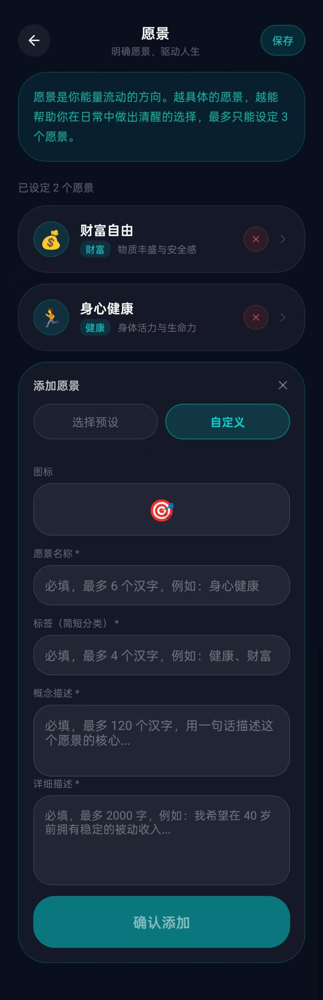
*愿景设定界面：预设愿景卡片 + 自定义愿景表单*

---

### 首页：能量罗盘

**视觉中心**：一个实时变化的 3D 能量球
- **状态好**：球体圆润、通透、缓慢自转（青金色）
- **状态差**：球体颜色较深、轻微抖动（紫色）
- **交互**：点击球体，直接触发记录弹窗

**核心操作区**（屏幕下半部）：
- 🔴 **左侧 (耗散/内耗)**：☁️ "感觉不对 / 内耗" — 觉知即功 +5
- 🟢 **右侧 (聚能/心流)**：🌊 "感觉对劲 / 心流" — 顺势而为 +5
- ⚡ **中间悬浮 (转念)**：小闪电，仅在检测到状态切换时高亮

**顶部信息**：
- 愿景标签横向滚动（如：事业发展 | 身心健康 | 宁静喜悦）
- 🔥 连续觉察天数徽章

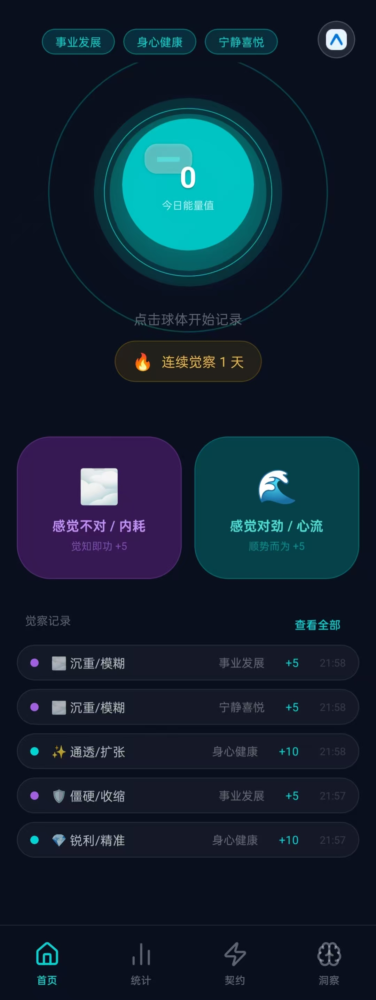
*首页：3D 能量球 + 快速记录按钮 + 今日记录列表*

---

### 记录流程：三步深度觉察

点击首页任意能量按钮后，全屏滑入记录页：

#### 第一步：身体和内心扫描 (Body Scan)

**文案**："此刻，你的身体/心里感觉像什么？"

从图形化卡片中选择最贴近的状态：

**📉 耗散态 (Entropy / Energy Drain)** — 选择后获得"觉知奖励"

| 状态 | 身体感受 | 对应心理 | 潜台词 |
|------|----------|----------|--------|
| 🔥 **燥热/紧绷** | 胸口发烫、手心出汗、牙关紧咬、呼吸急促 | 焦虑、愤怒、急躁、对抗 | "我想战斗，我想逃离" |
| 🌫️ **沉重/模糊** | 像灌了铅、头脑昏沉、不想动弹、嗜睡 | 拖延、迷茫、抑郁、无力感 | "我动不了，我看不到方向" |
| 🛡️ **僵硬/收缩** | 肩膀耸起、胃部抽搐、想要蜷缩、不敢深呼吸 | 恐惧、防御、讨好、自我压抑 | "别伤害我，我照你说的做" |
| 🌀 **空转/虚浮** | 脚不沾地、心里空落落、忙得停不下来却不知道为什么 | 虚假忙碌、逃避深度思考、刷屏成瘾 | "只要我不停下来思考，我就不会痛苦" |
| 🧱 **阻塞/淤堵** | 喉咙堵住、胸口有石头、想哭哭不出来 | 委屈、未表达的情绪、固执、关系僵局 | "我有话说不出的，卡在这里了" |

**📈 聚能态 (Negentropy / Energy Flow)** — 选择后获得"滋养反馈"

| 状态 | 身体感受 | 对应心理 | 潜台词 |
|------|----------|----------|--------|
| 🌊 **流动/轻盈** | 呼吸顺畅、动作自然、时间感消失（心流） | 专注、平静、高效、创造力 | "一切都在自然发生" |
| ✨ **通透/扩张** | 头顶清凉、胸腔开阔、全身微微发热、嘴角上扬 | 慈悲、喜悦、顿悟、感恩、利他 | "我感受到了爱，我理解了" |
| 🌱 **扎根/稳固** | 双脚稳稳踩地、脊柱挺直、重心下沉、有力量 | 定力、自律、拒绝诱惑、坚守原则 | "我知道我要去哪里" |
| 💎 **锐利/精准** | 眼神聚焦、感官敏锐、思维如刀锋般清晰 | 洞察、决断、逻辑闭环、解决难题 | "我看穿了本质，我决定行动" |

> 也支持 ✍️ **自定义输入**：自己编写身体感受、心理状态

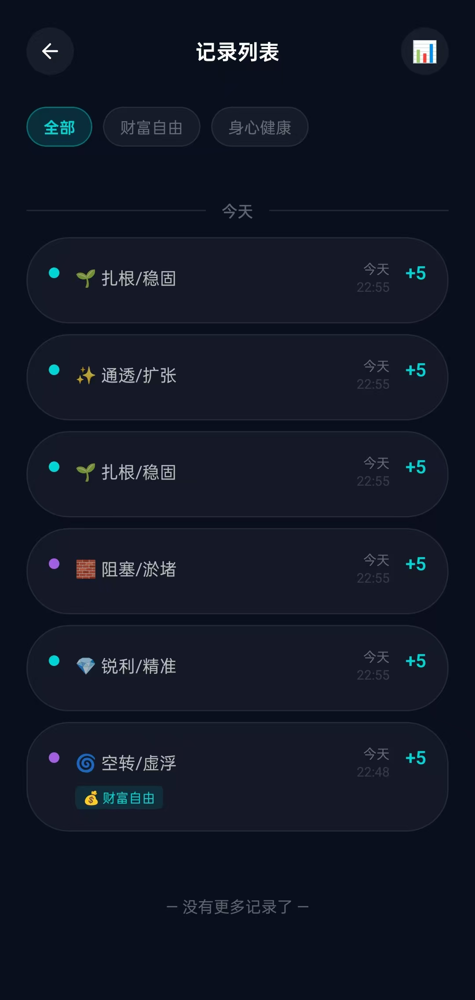
*记录页：身体状态选项卡片（耗散态/聚能态）+ 愿景选择 + 记录明细*

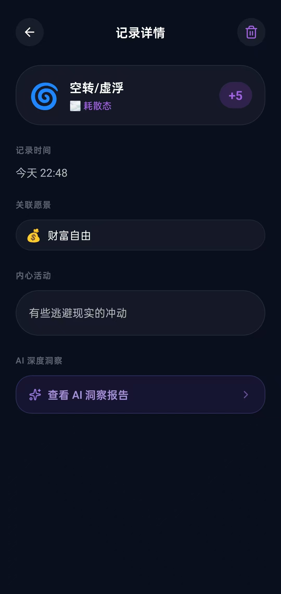
*记录详情页：查看单条记录的完整信息 + AI 洞察入口*

---

### 统计页：熵减热力图

**入口**：底部 Tab 栏 → 统计

**统计周期**：切换"今日" / "本周" / "本月"

**核心视图**：

1. **能量时间轴**
   - 横轴为 24 小时，纵轴为能量强度
   - 🟢 **绿色河流**代表聚能时段，🟣 **紫色漩涡**代表耗散时段
   - 直观看到"每天的高熵时刻"（如下午 3 点总是耗散）

2. **愿景能量雷达**
   - 展示各愿景维度的能量净值
   - 某维度长期负值时，该区域会有微弱的红色脉冲，提示关注

3. **本月记录热图**
   - 日历网格，颜色深浅表示能量净值
   - 紫色 → 耗散，青绿色 → 聚能

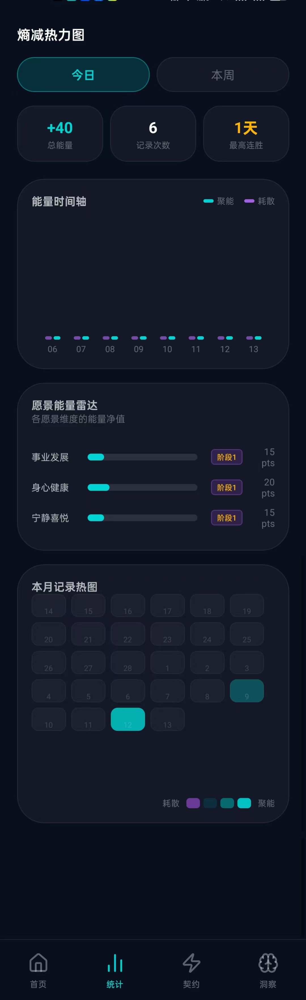
*统计页：能量时间轴 + 愿景能量雷达 + 本月记录热图*

---

### 能量契约页：微承诺闭环

**入口**：底部 Tab 栏 → 契约（能量加油站）

#### 场景 A：存在未完成的微承诺

**顶部区域**：
- 🔥 当前连胜天数 | 完成率进度条

**倒计时横幅**：
- ⏰ 剩余时间：01:59:42（动态倒计时）

**核心卡片**：
- 承诺内容（大字加粗）：如"不看视频"、"读书 1 小时"
- 关联愿景标签：💰 绑定愿景：财富自由
- 承诺时段：如 09:00 - 18:00

**操作区**：
- ✅ **做到了**：高亮主色按钮。点击后触发成功动画，归档该承诺
- ❌ **没做到**：次级灰色按钮。点击后弹出询问："是什么干扰了你？"

**点击"没做到"后的弹窗**：
- 输入框："请简单描述原因：例如：突然来了个紧急电话..."
- 快捷标签：[📱 手机干扰] [😫 太累了] [📅 太忙] [⛈️ 其他]
- 鼓励文案："💡 承认困难也是勇敢的表现。"
- 提交按钮："记录并重新开始"

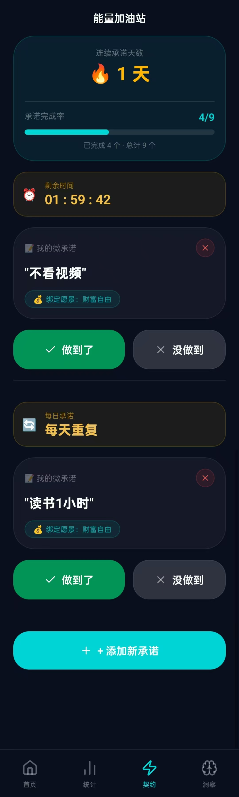
*能量契约页：进行中的微承诺 + 做到了/没做到按钮*

#### 场景 B：无未完成承诺

**中心插画**：空电池 / 种子图标

**文案**："能量槽已就绪，许下一个微小承诺吧！"

**操作**：[➕ 创建新承诺] 大尺寸按钮

**创建流程**：
1. **填写承诺**：限制 20 字以内，强调"微"（例："今天不吃夜宵"而非"我要减肥"）
2. **设定时间**：快捷选项 [1 小时内] [今天内] [本周内] 或自定义时间
3. **绑定愿景**：横向滑动选择（必选项）
4. **确认创建**：生成承诺卡片，进入场景 A

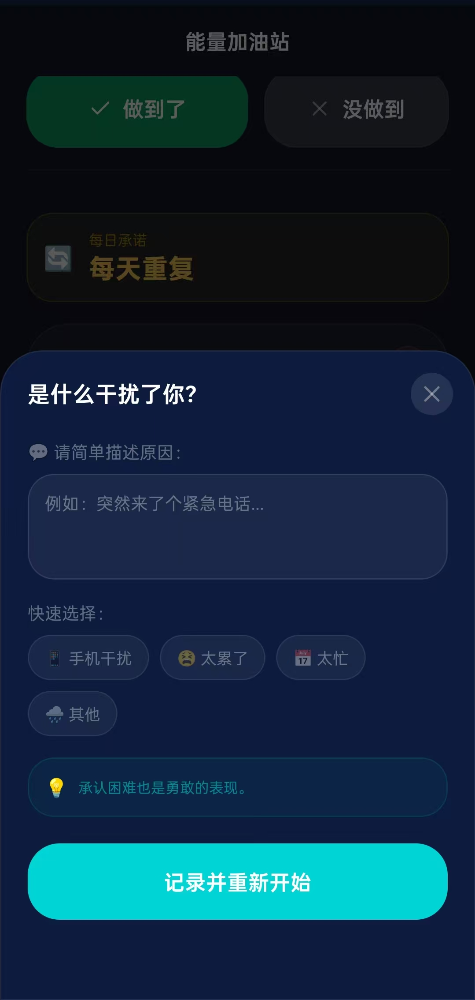
*能量契约页（空状态）：创建新承诺入口*

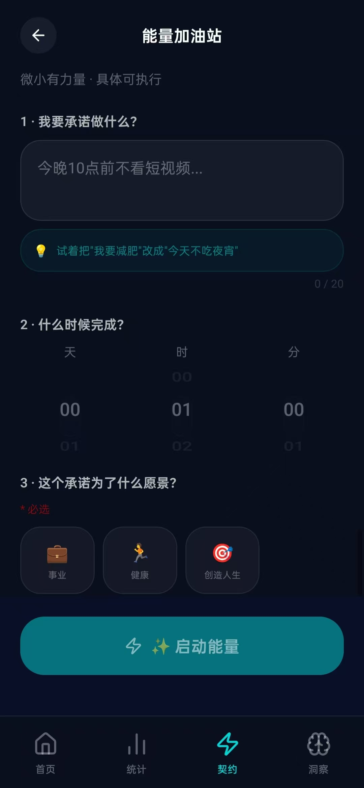
*创建承诺：填写承诺内容 + 设定时段 + 绑定愿景*

---

### 洞察分析页：私人能量教练

**入口**：底部 Tab 栏 → 洞察

**功能描述**：
- 展示所有历史能量记录列表
- 每条记录后有 **✨ 查看 AI 洞察报告** 按钮
- 点击分析 → 后台将愿景和内容组成提示词发送给大模型 → 生成深度报告

**AI 分析产出**（三个视角）：

1. **🏛️ 心理学视角**
   - 分析情绪根源（如：对失控的恐惧、寻求安全感）
   - 引用内在小孩、接纳等概念

2. **🧠 神经科学**
   - 脑科学解释（默认模式网络过度活跃、杏仁核激活）
   - 解释战斗或逃跑反应、多巴胺机制

3. **💡 个性化建议**（高亮青色框）
   - 编号可执行步骤：
     1. 身体扎根技巧（如：深呼吸 + 双脚踩地 1 分钟）
     2. 重新定义书写练习
     3. 重获掌控感的微行动

> **当前状态**：AI 分析为 Mock 数据，未接入真实 AI API（待完成）

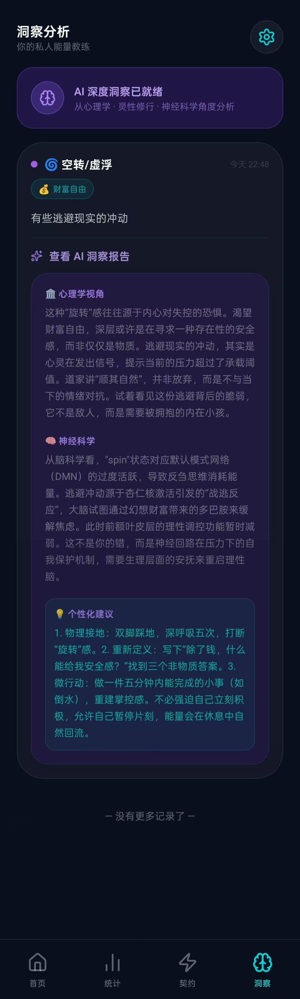
*洞察分析页：记录列表 + AI 深度洞察报告（心理学/神经科学/个性化建议）*

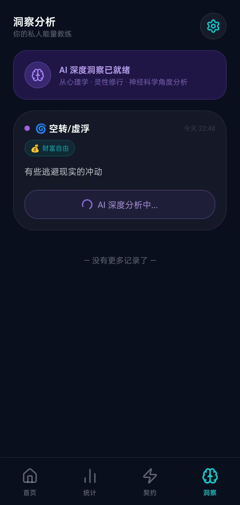
*AI 分析报告展开视图：三个视角的深度分析*

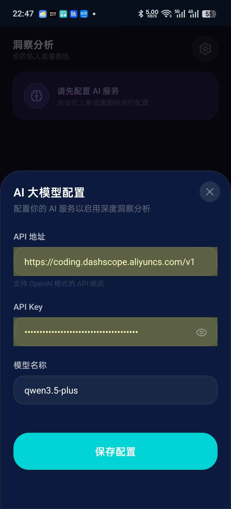
*洞察页配置：管理 AI 分析选项*

---

## 技术栈

- **框架**: Expo 55 + React Native 0.83 + React 19
- **语言**: TypeScript 5.9 (strict mode)
- **路由**: expo-router (文件路由)
- **存储**: SQLite + AsyncStorage
- **动画**: react-native-reanimated + Skia
- **UI**: react-native-svg, expo-haptics

## 环境要求

- Node.js 18+
- npm 或 yarn
- iOS: Xcode 15+ (macOS only)
- Android: Android Studio + JDK 17+

## 安装

```bash
# 克隆项目
git clone <repository-url>
cd energy-ledger

# 安装依赖
npm install
```

## 运行

```bash
# 启动 Expo 开发服务器
npm start

# iOS 模拟器
npm run ios

# Android 模拟器
npm run android

# Web 版本
npm run web
```

## 功能实现度分析

> 对照产品设计文档 `功过格产品设计说明.md` 的完整分析

### 📊 总体实现度: **92%**

| 模块 | 实现度 | 状态 |
|------|--------|------|
| 首页 (能量罗盘) | 95% | ✅ 核心完成 |
| 记录页 (身体扫描) | 100% | ✅ 完全实现 |
| 统计页 (热力图) | 90% | ✅ 可用 |
| 能量契约页 | 95% | ✅ 核心完成 |
| 洞察分析页 | 85% | ⚠️ Mock AI |
| 愿景设定页 | 100% | ✅ 完全实现 |
| 引导页 | 100% | ✅ 完全实现 |
| 数据层 | 100% | ✅ 完全实现 |

---

### 🏠 首页 (能量罗盘)

**实现度: 95%**

| 功能 | 状态 | 文件位置 |
|------|------|----------|
| 3D 能量球 | ✅ | `src/components/EnergyBall.tsx:26` |
| 能量球点击记录 | ✅ | `app/(tabs)/index.tsx:163` |
| 状态颜色变化 (青金/紫) | ✅ | `src/components/EnergyBall.tsx:83-86` |
| 浮动动画 | ✅ | `src/components/EnergyBall.tsx:38-45` |
| 脉冲环动画 | ✅ | `src/components/EnergyBall.tsx:48-64` |
| 耗散按钮 | ✅ | `app/(tabs)/index.tsx:176-184` |
| 聚能按钮 | ✅ | `app/(tabs)/index.tsx:186-194` |
| 转念按钮 | ✅ | `app/(tabs)/index.tsx:197-202` |
| 今日记录列表 | ✅ | `app/(tabs)/index.tsx:206-228` |
| 连续觉察天数 | ✅ | `app/(tabs)/index.tsx:168-171` |
| 愿景标签滚动 | ✅ | `app/(tabs)/index.tsx:135-157` |
| 球体表面纹理效果 | ❌ | Skia 仅绘制基础圆形 |

**缺失项:**
- 能量球表面纹理/粗糙度效果（设计要求"状态差时表面粗糙、浑浊"）

---

### 📝 记录页 (身体扫描)

**实现度: 100%**

| 功能 | 状态 | 文件位置 |
|------|------|----------|
| 三步流程 | ✅ | `app/record.tsx:41-42` |
| 耗散态选项 (5种) | ✅ | `src/types/index.ts:112-172` |
| 聚能态选项 (4种) | ✅ | `src/types/index.ts:175-225` |
| 自定义状态输入 | ✅ | `app/record.tsx:200-225` |
| 愿景多选 | ✅ | `app/record.tsx:270-292` |
| 日志输入 | ✅ | `app/record.tsx:318-326` |
| 提交视觉反馈 | ✅ | `app/record.tsx:100-131` |
| 得分动画 | ✅ | `app/record.tsx:111-120` |
| 触觉反馈 | ✅ | `app/record.tsx:69` |
| 能量评分计算 | ✅ | `app/record.tsx:52-60` |

**完全符合设计规范**

---

### 📈 统计页 (熵减热力图)

**实现度: 90%**

| 功能 | 状态 | 文件位置 |
|------|------|----------|
| 周期切换 (今日/本周/本月) | ✅ | `app/(tabs)/stats.tsx:19-24` |
| 能量时间轴 | ✅ | `app/(tabs)/stats.tsx:185-218` |
| 愿景能量雷达 | ✅ | `app/(tabs)/stats.tsx:222-259` |
| 本月记录热图 | ✅ | `app/(tabs)/stats.tsx:262-299` |
| 愿景维度警示 | ✅ | `app/(tabs)/stats.tsx:251-258` |
| 总能量统计 | ✅ | `app/(tabs)/stats.tsx:149-166` |

**与设计差异:**
- 时间轴使用简单条形图，非设计中的"绿色河流/紫色漩涡"形态

---

### ⚡ 能量契约页 (微承诺)

**实现度: 95%**

| 功能 | 状态 | 文件位置 |
|------|------|----------|
| 有承诺状态 (场景A) | ✅ | `app/(tabs)/contract.tsx:173-233` |
| 无承诺状态 (场景B) | ✅ | `app/(tabs)/contract.tsx:235-252` |
| 创建承诺流程 | ✅ | `app/(tabs)/contract.tsx:254-329` |
| 动态倒计时 | ✅ | `app/(tabs)/contract.tsx:53-75` |
| "做到了"按钮 | ✅ | `app/(tabs)/contract.tsx:216-223` |
| "没做到"按钮 + 弹窗 | ✅ | `app/(tabs)/contract.tsx:224-231,345-391` |
| 失败原因快捷标签 | ✅ | `app/(tabs)/contract.tsx:25` |
| 成功动画 | ✅ | `app/(tabs)/contract.tsx:144-157` |
| 能量值/连胜展示 | ✅ | `app/(tabs)/contract.tsx:176-191` |

**缺失项:**
- 往期承诺回顾列表

---

### 🧠 洞察分析页

**实现度: 85%**

| 功能 | 状态 | 文件位置 |
|------|------|----------|
| 记录列表 | ✅ | `app/(tabs)/insights.tsx:139-242` |
| AI 分析按钮 | ✅ | `app/(tabs)/insights.tsx:175-193` |
| AI 报告展示 | ✅ | `app/(tabs)/insights.tsx:196-239` |
| 心理学视角 | ✅ | `app/(tabs)/insights.tsx:28` |
| 神经科学分析 | ✅ | `app/(tabs)/insights.tsx:29` |
| 个性化建议 | ✅ | `app/(tabs)/insights.tsx:30` |

**重要限制:**
- AI 分析为 **Mock 数据**，未接入真实 AI API
- 位置: `app/(tabs)/insights.tsx:20-41`

---

### 🎯 愿景设定页

**实现度: 100%**

| 功能 | 状态 | 文件位置 |
|------|------|----------|
| 预设愿景 (10种) | ✅ | `src/types/index.ts:98-109` |
| 添加新愿景 | ✅ | `app/vision.tsx:31-48` |
| 删除愿景 | ✅ | `app/vision.tsx:50-54` |
| 愿景详述编辑 | ✅ | `app/vision.tsx:56-59` |
| 展开详情 | ✅ | `app/vision.tsx:133-172` |

---

### 🚀 引导页

**实现度: 100%**

| 功能 | 状态 | 文件位置 |
|------|------|----------|
| 欢迎界面 | ✅ | `app/onboarding.tsx:67-98` |
| 愿景选择 (1-5个) | ✅ | `app/onboarding.tsx:101-155` |
| 完成后跳转 | ✅ | `app/onboarding.tsx:61` |
| 引导状态持久化 | ✅ | `src/store/storage.ts:267-274` |

---

### 💾 数据层

**实现度: 100%**

| 功能 | 状态 | 文件位置 |
|------|------|----------|
| SQLite 数据库初始化 | ✅ | `src/store/storage.ts:11-55` |
| 愿景 CRUD | ✅ | `src/store/storage.ts:65-104` |
| 能量记录 CRUD | ✅ | `src/store/storage.ts:108-175` |
| 微承诺 CRUD | ✅ | `src/store/storage.ts:179-235` |
| 用户统计 | ✅ | `src/store/storage.ts:239-263` |
| React Context 状态管理 | ✅ | `src/store/AppContext.tsx:38-208` |

---

## 项目结构

```
energy-ledger/
├── app/                  # 文件路由 (expo-router)
│   ├── (tabs)/           # Tab 导航: 首页、统计、契约、洞察
│   │   ├── index.tsx     # 首页 (484 行)
│   │   ├── stats.tsx     # 统计页 (556 行)
│   │   ├── contract.tsx  # 契约页 (805 行)
│   │   └── insights.tsx  # 洞察页 (473 行)
│   ├── _layout.tsx       # 根布局 + 引导页跳转
│   ├── onboarding.tsx    # 首次使用引导 (280 行)
│   ├── record.tsx        # 能量记录弹窗 (642 行)
│   └── vision.tsx        # 愿景管理弹窗 (473 行)
├── src/
│   ├── components/       # 可复用 UI 组件
│   │   ├── Button.tsx    # 触觉反馈按钮 (149 行)
│   │   ├── Card.tsx      # 主题容器 (57 行)
│   │   ├── EnergyBall.tsx# 3D 能量球 (182 行)
│   │   └── Modal.tsx     # 模态框
│   ├── store/            # 状态管理
│   │   ├── AppContext.tsx# React Context (216 行)
│   │   └── storage.ts    # SQLite 层 (293 行)
│   ├── types/            # 类型定义
│   │   └── index.ts      # 域类型 + 预设 (235 行)
│   └── utils/            # 工具函数
│       └── theme.ts      # 主题系统 (160 行)
└── index.ts              # 入口文件
```

---

## 开发约定

- **路径别名**: 使用 `@/` 导入 `src/` 目录 (例: `import { colors } from '@/utils/theme'`)
- **类型安全**: TypeScript strict 模式已启用，禁止使用 `any`
- **动画**: 使用 react-native-reanimated 处理动画，Skia 处理复杂图形
- **触觉反馈**: 用户交互时必须触发 haptic 反馈 (expo-haptics)
- **样式**: 使用 StyleSheet.create()，引用 `@/utils/theme` 中的主题令牌

---

## 待完成事项

### 高优先级
- [ ] 接入真实 AI API (替代 Mock 数据)
- [ ] 能量球表面纹理效果

### 中优先级
- [ ] 往期承诺回顾列表
- [ ] 时间轴"河流/漩涡"形态可视化
- [ ] 添加测试

### 低优先级
- [ ] CI/CD 配置
- [ ] EAS Build 配置

---

## 部署

使用 EAS (Expo Application Services) 进行构建和部署:

```bash
# 安装 EAS CLI
npm install -g eas-cli

# 配置项目
eas build:configure

# 构建
eas build --platform ios
eas build --platform android

# 提交到应用商店
eas submit --platform ios
eas submit --platform android
```

---

## 文档

- 产品设计说明: `功过格产品设计说明.md`
- 开发知识库: `AGENTS.md`
- 组件文档: `src/components/AGENTS.md`
- 状态管理: `src/store/AGENTS.md`